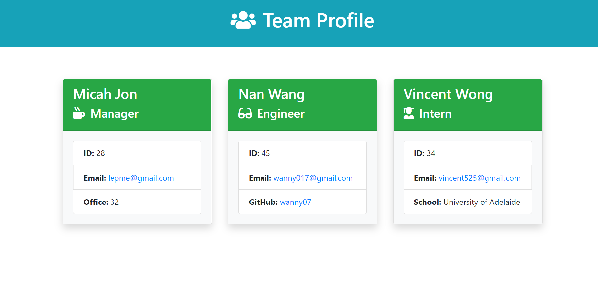

<h1 align="center">Team Profile Generator</h1>

  [](https://opensource.org/licenses/MIT)


## Table of Contents

  - [Description](#description)
  - [Demo](#demo)
  - [Installation](#installation)
  - [Usage](#usage)
  - [Contributors](#contributors)
  - [Tests](#tests)
  - [License](#license)
  - [Questions](#questions)

  
  ## Description
  This Team Generator application takes in command-line input to collect certain professional details about each individual. In this application, the user is able to add a Manager, an Engineer, and an Intern to their team. From there, a functional and professionally formatted HTML document is rendered to the ```dist``` folder.

  ## Demo
  
  

  To view the full demo, please direct yourself to ```assests``` folder.
  

  ## Installation
 ``` 
 node i inquirer
  ```
 ``` 
 node i fs 
 ```
 ``` 
 node i jest
  ```

  Once all third-party packages have been successfully installed, the application is ready to use. For more details, reference the application's ```package.json``` file.

  ## Usage
  To launch the application from the command line, navigate to the project's root directory and run:
  ```
  node index.js
  ```

  The application begins by prompting the user to begin describing the Manager by name, employee ID, email address, and their office number. The user is then prompted to either add an Engineer, Intern, or complete the team profile. If an Engineer is added to the team, the user is prompted to enter their name, email address, employee ID, and Github username. If an Intern is to be added, the user is prompted to enter their name, email address, employee ID, and the school they attend. After their team is complete, the file is written to the dist folder and the user is able to see their creation!

  ## Contributors
  Nan Wang

  ## Tests
  The Team Profile Generator uses the Jest package to test the functionality of the four primary classes associated with the application. To run all four tests:

  ```
  npm run test
  ```

  

  ## License
  Licensed under the [MIT license](https://opensource.org/licenses/MIT).

  ## Questions
  Reach me on [GitHub](https://www.github.com/wanny017)  
  Reach me via email at <wanny017@gmail.com>

